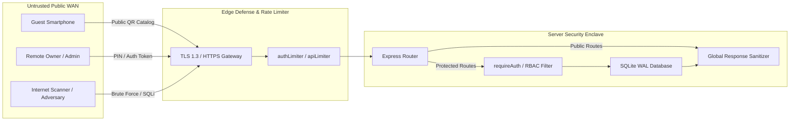

# Remote Access & Network Boundary Specification
**MENA Cafe ERP Enterprise Platform — Perimeter Defense & Data Protection**

---

## 1. Network Boundary Architecture

The Cafe ERP server operates behind a zero-trust perimeter separating public clients (customer smartphones scanning QR codes, off-site owners) from local LAN staff terminals (POS, KDS, runner tablets).



---

## 2. Endpoint Perimeter Classification

### Category A: Public Unauthenticated Endpoints (Zero Sensitive Data)
1. `GET /api/build-info`: Returns sanitized build SHA, schema version, and server instance ID. **Never exposes DB path, environment variables, or private IPs**.
2. `POST /api/auth/login`: Rate-limited PIN submission gateway (`authLimiter`). Rejects invalid PINs without revealing username/account existence.
3. `GET /manifest.json`, `/sw.js`, and static HTML/JS/CSS assets.
4. `GET /qr-menu.html` & `GET /api/menu/public`: Read-only customer catalog (prices and items only; BOM raw costs strictly filtered out).

### Category B: Authenticated Staff Endpoints (`requireAuth`)
- All POS ordering, hospitality table operations, KDS transitions, runner task claims, shift clocking, CRM reviews, and stocktake counts.
- **Authorization Check**: `hasPermission(req.user.role, requiredPermission)` strictly enforced before executing domain handlers.

### Category C: High-Risk Administrative & System Surfaces (`system:settings` / `OWNER`)
- `POST /api/settings/backup`: Generates hot VACUUM INTO snapshot; requires `OWNER` or `SUPER_ADMIN`.
- `POST /api/settings/restore`: Restores database from backup; requires `OWNER` role + secondary PIN re-authentication.
- `POST /api/settings/reset`: Factory reset; requires `OWNER` role + secondary PIN re-authentication.
- `POST /api/system-update/upload-package`: Updates system code; requires checksum and digital signature validation.

---

## 3. Defense Against Common Web Vulnerabilities

### 1. Information Disclosure & Error Sanitization
- In production, server exceptions are logged internally via `observability/logger.js` with full stack traces.
- External HTTP response returns a sanitized JSON object:
  ```json
  {
    "success": false,
    "error": "INTERNAL_SERVER_ERROR: An unexpected error occurred",
    "code": "INTERNAL_ERROR",
    "requestId": "3554f17a-96b4-49f7-96fa-c15bd127a875"
  }
  ```
- **Zero SQL Leakage**: SQLite syntax errors, table names, and query fragments are never returned in client HTTP payloads.

### 2. SQL Injection (SQLi) Defense
- All database queries use parameterized SQL (`runQuery`, `getQuery`, `allQuery`) with `?` placeholders.
- Dynamic table names or column names are validated against strict internal allowlists.

### 3. Cross-Site Scripting (XSS) & Content Security
- HTML output encoding on customer-supplied strings (guest names, special instructions).
- Strict HTTP Response Headers:
  - `X-Content-Type-Options: nosniff`
  - `X-Frame-Options: SAMEORIGIN`
  - `X-XSS-Protection: 1; mode=block`
  - `Referrer-Policy: strict-origin-when-cross-origin`

### 4. Cross-Site Request Forgery (CSRF) Defense
- Cookies configured with `SameSite=Lax` and `HttpOnly`.
- State-modifying API requests (POST/PUT/DELETE) require custom header validation or explicit JSON body schemas.
