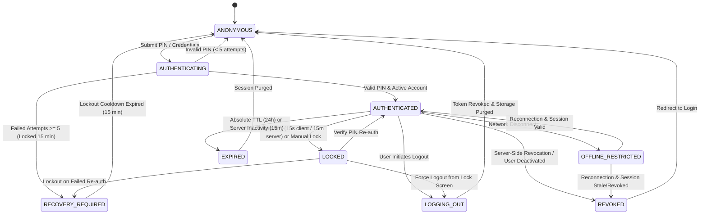

# Session Lifecycle & State Machine Specification
**MENA Cafe ERP Enterprise Platform — Authentication & Access Control**

---

## 1. Formal State Definitions

The Cafe ERP authentication lifecycle is governed by a deterministic, server-enforced state machine across 9 canonical states:

---

## 2. Detailed State Descriptions & Transitions

### 1. `ANONYMOUS`
- **Definition**: No active server session exists. Client browser holds no valid `session_token` cookie or header.
- **Allowed Actions**:
  - `GET /` and static HTML asset shells (via Service Worker cache).
  - `GET /api/build-info` (sanitized public build metadata).
  - `POST /api/auth/login` (rate-limited PIN submission).
  - `GET /qr-menu.html` (public guest catalog view).
- **Forbidden Actions**: All `/api/*` endpoints requiring business authorization reject with HTTP 401 `AUTH_REQUIRED`.

### 2. `AUTHENTICATING`
- **Definition**: Ephemeral state during server-side verification of submitted PIN.
- **Security Invariants**:
  - Validates PIN string (`>= 4 digits`).
  - Queries `v3_users` for active status and `locked_until` timestamps.
  - Compares `bcrypt` hash with work factor 10.
  - On failure: increments `failed_attempts`; triggers 15-minute lock if `>= 5`.
  - On success: resets `failed_attempts = 0`, generates 32-byte cryptographically secure session token, computes SHA-256 hash, and inserts row in `v3_user_sessions`.

### 3. `AUTHENTICATED`
- **Definition**: Fully authenticated staff session with server-validated role and permissions.
- **Security Invariants**:
  - Token verified against `v3_user_sessions` and `v3_users.is_active = 1` on every HTTP request and WebSocket handshake.
  - Server extends `inactivity_expiry_at` (sliding 15-minute window) on active requests.
  - Absolute hard timeout fixed at 24 hours (`absolute_expiry_at`).
  - Client holds non-sensitive profile info (`id`, `name`, `role`, `venueId`, `safePermissions`) in memory.

### 4. `LOCKED`
- **Definition**: UI is masked by a modal security overlay, protecting active orders from unauthorized access during staff absence.
- **Trigger**:
  - Client inactivity timer (15 seconds idle on terminal).
  - Manual staff action (clicking "Lock Screen" button).
- **Security Invariants**:
  - Server session remains valid in database; background WebSocket events continue syncing.
  - UI hides sensitive financials, discounts, and customer contact data behind the lock screen.
  - Unlock requires `POST /api/auth/unlock` or `/api/auth/verify-pin`.
  - Multiple failed unlock attempts escalate to `RECOVERY_REQUIRED` (account lock).

### 5. `LOGGING_OUT`
- **Definition**: Transitional state during intentional session termination.
- **Execution Protocol**:
  1. Client sends `POST /api/auth/logout`.
  2. Server marks `v3_user_sessions.revoked_at = datetime('now', 'localtime')`.
  3. Server logs structured `LOGOUT` audit event to `v3_audit_logs`.
  4. Server responds with `Set-Cookie: session_token=; Max-Age=0; HttpOnly`.
  5. Client executes `sessionStorage.clear()`, removes user keys from `localStorage`, cancels active timers, and redirects to `/portal.html`.

### 6. `REVOKED`
- **Definition**: Session was explicitly invalidated server-side prior to normal expiration.
- **Triggers**:
  - User logged out from another terminal or clicked "Revoke All Sessions".
  - Administrator disabled the staff account (`v3_users.is_active = 0`).
  - User changed/rotated their PIN via `POST /api/auth/rotate-pin`.
- **Client Behavior**: Next API call or WebSocket ping receives HTTP 401 `SESSION_REVOKED`; client purges local state and redirects to login.

### 7. `EXPIRED`
- **Definition**: Session reached inactivity threshold (15 minutes without interaction) or absolute ceiling (24 hours).
- **Security Invariants**:
  - `validateSession()` automatically marks `v3_user_sessions.revoked_at` upon detecting an expired timestamp.
  - Client-side token becomes permanently inert.

### 8. `OFFLINE_RESTRICTED`
- **Definition**: Terminal lost network connectivity while in `AUTHENTICATED` state.
- **Security Invariants**:
  - Read-only browsing of locally cached catalog and active tables permitted.
  - Non-financial mutations (`SUBMIT_ORDER`, `CLAIM_RUNNER_TASK`, `UPDATE_TABLE_STATUS`) queued in `IndexedDB` with immutable `actor_id` signature.
  - **Financial Gate**: Payment settlements (`SETTLE_PAYMENT`), refunds (`VOID_PAID`), and shift closes (`EOD_CLOSE`) are strictly blocked with `UNSAFE_OFFLINE_ACTION`.
  - Reconnection triggers sequence gap recovery and actor verification.

### 9. `RECOVERY_REQUIRED`
- **Definition**: Security lockout triggered by 5 consecutive invalid PIN attempts, corrupted session state, or revoked device registration.
- **Security Invariants**:
  - Account blocked from all authentication attempts for 15 minutes (`ACCOUNT_LOCKED`).
  - Lockout cannot be bypassed by browser refresh, private window, or cookie deletion.
  - Owner/Manager can manually clear lockout via HR admin panel if immediate access is required.

---

## 3. State Transition Validation Table

| Source State | Target State | Trigger / Event | Server Authorization | Client State Action |
|---|---|---|---|---|
| `ANONYMOUS` | `AUTHENTICATING` | `POST /api/auth/login` | Rate Limiter (`authLimiter`) | Display loading spinner |
| `AUTHENTICATING` | `AUTHENTICATED` | PIN Valid | Hash match, `is_active=1`, `locked_until=NULL` | Set cookie, navigate to `defaultRoute` |
| `AUTHENTICATING` | `RECOVERY_REQUIRED` | 5 Failed PINs | `failed_attempts >= 5` ➔ Lock 15m | Show locked alert & cooldown timer |
| `AUTHENTICATED` | `LOCKED` | Idle / Click | Client timer / event | Render lock overlay; mask sensitive DOM |
| `LOCKED` | `AUTHENTICATED` | `POST /api/auth/unlock` | Verify PIN against `v3_users.pin_hash` | Remove lock overlay; resume session |
| `AUTHENTICATED` | `LOGGING_OUT` | `POST /api/auth/logout` | Set `revoked_at` in database | Clear storage, redirect to login |
| `AUTHENTICATED` | `OFFLINE_RESTRICTED` | `window.offline` | Client network monitor | Show offline indicator; block payments |
| `OFFLINE_RESTRICTED` | `AUTHENTICATED` | `window.online` | WebSocket handshake & replay | Sync offline queue; resume live status |
| `AUTHENTICATED` | `REVOKED` | Admin Deactivation | `u.is_active = 0` | Force logout; redirect to login |
