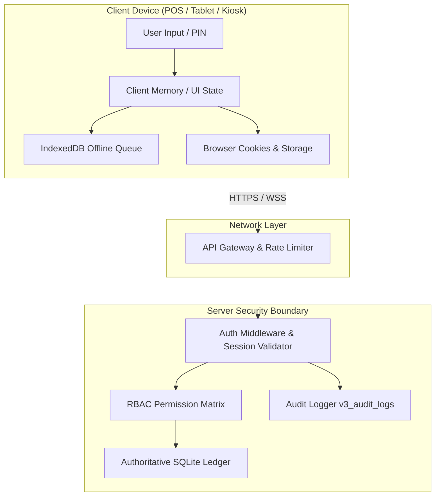

# Shared-Device, Kiosk & Remote-Access Threat Model
**MENA Cafe ERP Enterprise Platform — Security Architecture Specification**

---

## 1. System Overview & Deployment Topology

The Cafe ERP is deployed across heterogeneous physical and network environments:
1. **Counter POS Terminals (Shared Desktop/Touch PC)**: High-throughput cashier stations used interchangeably by cashiers, operations assistants, and managers.
2. **Floor Waiter & Runner Tablets (Handheld Mobile Devices)**: Shared handheld tablets utilized across morning/night shifts for tableside ordering and delivery.
3. **Kitchen / Barista / Shisha Display Systems (KDS Fixed Wall Mounts)**: Dedicated station displays operating in high-volume, touchscreen environments.
4. **Self-Service Customer Kiosks / QR Code Tables**: Untrusted, customer-facing touchscreens and guest smartphones.
5. **Remote Manager / Owner Portal**: Off-premise web access over HTTPS for BI analytics, inventory audits, and payroll approval.

---

## 2. Asset Classification & Sensitivity Levels

| Asset | Sensitivity | Primary Impact of Compromise |
|---|:---:|---|
| **Cash Drawer & Float** | Critical | Physical theft, unrecorded cash shrinkage, falsified EOD variance. |
| **Financial Ledger & Settlement** | Critical | False sales creation, unauthorized manager discounts, illicit refunds. |
| **BOM Recipes & Raw Cost Basis** | High | Intellectual property theft, supplier pricing leaks, margin exposure. |
| **Customer Data & CRM Loyalty** | High | PII breach, unauthorized points drain, phone number harvesting. |
| **Staff Identities & PIN Credentials** | Critical | Non-repudiation collapse, impersonation of managers or supervisors. |
| **Offline Command Outbox** | High | Replay attacks, out-of-order execution, forged draft orders. |

---

## 3. Shared-Device Architectural Model & Design Choice

### Chosen Architecture: Dedicated Browser Contexts with Per-Tab Session Boundaries

On shared physical POS terminals, single shared cookie stores create severe risks of cross-tab impersonation where Tab A performs actions under User 1 while Tab B performs actions under User 2.

#### Core Architectural Guarantees:
1. **Server-Authoritative Tokens**: Authentication is never verified from client claims. Every request evaluates `v3_user_sessions` against `v3_users.is_active` and `roles`.
2. **Multi-Header Fallback**: Supports `session_token` HTTP-only cookies for single-user browsers, while enabling explicit `x-session-token` headers for multi-tab/multi-window POS stations.
3. **Storage Sanitization on User Switch**: `sessionStorage.clear()`, `localStorage.removeItem('currentUser')`, and active UI memory purging on every logout or lock event.
4. **Offline Queue Actor Stamping**: Every command queued in IndexedDB stores the immutable `actor_id` and `device_id` captured at command creation. If the active user changes before reconnect, mismatched commands are flagged `STALE_ACTOR_MISMATCH` and blocked from automatic replay.

---

## 4. Threat Matrix & Defense-in-Depth Mitigations

### Threat Analysis & Implemented Controls

#### T1. Previous User Data Visible After Logout
- **Threat**: A cashier logs out, and the next cashier uses browser "Back" navigation or inspects DOM state to view previous customer orders, financial totals, or supervisor discount reasons.
- **Mitigations**:
  - `Cache-Control: no-store, no-cache, must-revalidate, proxy-revalidate` on all `/api/*` routes.
  - Client-side `auth.logout()` invokes `sessionStorage.clear()`, clears `localStorage` user keys, and triggers a full DOM redirect to `/portal.html`.
  - Service Worker `public/sw.js` explicitly excludes `/api/*` routes from cache matching.

#### T2. Cross-Tab Session Collision on Shared Hardware
- **Threat**: Two browser tabs open on the same POS terminal; Tab 1 is used by Waiter A, Tab 2 by Cashier B. Requests from Tab 1 execute under Cashier B's cookie.
- **Mitigations**:
  - `auth.js` enforces tab-isolated session references.
  - Server endpoints accept explicit `x-session-token` overrides for multi-tenant split terminals.
  - Every financial mutation requires explicit `actor_id` verification matching the server-resolved session user.

#### T3. Stolen or Guessed PIN / Brute Force Enumeration
- **Threat**: Adversary attempts 4-digit PIN combinations (0000–9999) at an unattended POS or lock screen.
- **Mitigations**:
  - PINs hashed using `bcrypt` (Work Factor 10) with unique salt per user.
  - Account-level lock: 5 consecutive failed attempts lock the account for 15 minutes (`locked_until`).
  - IP rate limiting: `authLimiter` restricts rapid brute-force attempts via `express-rate-limit`.
  - All failed login attempts log structured audit events to `v3_audit_logs`.

#### T4. Role / Permission Changes During Active Session
- **Threat**: A cashier's permissions are downgraded or account disabled by the Owner, but their existing JWT/cookie remains valid.
- **Mitigations**:
  - Zero stateless JWTs: all authentication uses stateful database sessions (`v3_user_sessions`).
  - `validateSession()` executes a live `JOIN v3_users` and `JOIN roles` on every request.
  - Disabling a user (`is_active = 0`) immediately invalidates all active sessions without waiting for TTL expiry.

#### T5. Stale Draft / Order Restored to Wrong Person
- **Threat**: Cashier A starts drafting an order with a custom discount; Cashier B logs in and the system auto-restores Cashier A's unposted draft.
- **Mitigations**:
  - Local drafts in `IndexedDB` and UI state are keyed with `userId` and `venueId`.
  - Upon user change, active drafts without matching ownership are archived or purged.

#### T6. Offline Queue Replay Under Wrong Actor
- **Threat**: Device goes offline during Shift A; Shift B begins with different staff; upon reconnection, Shift A commands replay under Shift B credentials.
- **Mitigations**:
  - Commands in `IndexedDB` record `actor_id`, `shift_id`, `created_at`, and `idempotency_key`.
  - Replay worker checks `command.actor_id === currentSession.userId`. If mismatched, command is rejected or escalated to supervisor review.
  - Financial settlements (`SETTLE_PAYMENT`, `EOD_CLOSE`) are strictly blocked from offline execution (`UNSAFE_OFFLINE_ACTION`).

#### T7. Caffeine Mode / Inactivity Lock Bypass
- **Threat**: Cashier uses browser extensions or auto-clickers to keep session alive indefinitely overnight.
- **Mitigations**:
  - Dual Expiry Engine:
    - **Inactivity Timeout**: 15 minutes of idle time automatically revokes session.
    - **Absolute Expiry**: 24-hour hard ceiling terminates session regardless of activity.

#### T8. Native Browser Dialog Blocking & Phishing
- **Threat**: Native `alert()`, `confirm()`, `prompt()` calls freeze UI threads, break kiosk fullscreen confinement, and display unstyled browser chrome.
- **Mitigations**:
  - Inventory of all legacy native dialogs.
  - Native dialog replacement strategy using non-blocking modal overlays (`ui-state.js`).

#### T9. Remote Access & Information Disclosure
- **Threat**: External attacker queries `/api/*` from internet and receives detailed SQL error dumps, database paths, or admin configuration.
- **Mitigations**:
  - Global error handler catches all uncaught exceptions, scrubs stack traces and SQL queries, returning a sanitized `{ success: false, error: '...', requestId: '...' }`.
  - All admin endpoints require explicit `requireAuth` + RBAC permission checks.

---

## 5. Threat Modeling Summary & Security Posture

The Cafe ERP security boundary enforces **Zero Trust Client Execution**: the server assumes all client devices (terminals, tablets, kiosks) may be lost, disconnected, or shared across competing staff roles. Financial and inventory consistency relies 100% on transactional server validation and append-only ledgers.
